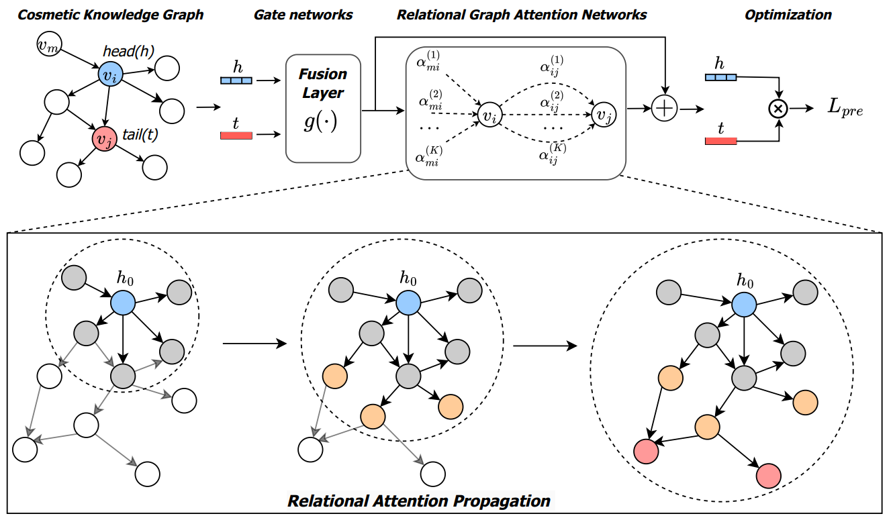

# Halal or Not

Halal or Not is a novel Attributed Knowledge Graph Completion Model developed by NS Lab @ CUK based on pure PyTorch backend. This model aims at analyzing ingredients of everyday products to predict their cultural availability, e.g. predicting whether food or cosmetics meet halal or vegan criteria.

<p align=center>
  <a href="https://www.python.org/downloads/release/python-360/">
    =3.6-3776AB?logo=python&style=flat-square" alt="Python">
  </a>    
  <a href="https://github.com/pytorch/pytorch">
    =1.4-FF6F00?logo=pytorch&style=flat-square" alt="pytorch">
  </a>       
  
  
  
  
  
  
  
</p>

<be>

## 1. Overview

The growing demand for halal cosmetic products has exposed significant challenges, especially in Muslimmajority countries. Recently, various machine learning-based strategies, e.g., image-based methods, have shown remarkable success in predicting the halal status of cosmetics. However, these methods mainly focus on analyzing the discrete and specific ingredients within separate cosmetics, which ignore the high-order and complex relations between cosmetics and ingredients. To address this problem, we propose a halal cosmetic recommendation framework, namely HaCKG, that leverages a knowledge graph of cosmetics and their ingredients to explicitly model and capture the relationships between cosmetics and their components. By representing cosmetics and ingredients as entities within the knowledge graph, HaCKG effectively learns the high-order and complex relations between entities, offering a robust method for predicting halal status. Specifically, we first construct a cosmetic knowledge graph representing the relations between various cosmetics, ingredients, and their properties. We then propose a pre-trained relational graph attention network model with residual connections to learn the structural relation between entities in the knowledge graph. The pre-trained model is then fine-tuned on downstream cosmetic data to predict halal status. Extensive experiments on the cosmetic dataset over halal prediction tasks demonstrate the superiority of our model over state-of-the-art baselines.

<br>

<p align="center">
  
  <br>
  <b></b> The overall architecture of HaCKG
</p>

## 2. Reproducibility

#### Setup environment for running:

- Running: `python -m venv HaCKG`

#### Install pip packages:

`pip install -r requirements.txt`

#### To pre-train HaCKG model:

- Running `python main_pretraining_BCE.py --aggregation_type gcn --n_conv_layers 2 --lr 0.0001 --mess_dropout 0.1 --conv_dim 16 --pre_training_batch_size 1024 --fine_tuning_batch_size 1024 --device cuda:0`

#### To fine-tune HaCKG model:

- Running `python main_finetuning_BCE.py --aggregation_type gcn --n_conv_layers 2 --lr 0.0001 --mess_dropout 0.1 --conv_dim 16 --pre_training_batch_size 1024 --fine_tuning_batch_size 1024 --pretrain_epoch 482 --device cuda:0`

## 3. Reference

:page_with_curl: Paper
* [](https://doi.org/10.1109/ACCESS.2025.3528251)

:page_with_curl: Paper [on arXiv](https://arxiv.org/): 
* [](https://arxiv.org/abs/2501.05768) 

:pencil: Blog [on Network Science Lab](https://nslab-cuk.github.io/2023/08/30/LiteralKG/)
* [](https://nslab-cuk.github.io/2025/01/08/HaCKG/)


## 4. Citing HaCKG

Please cite our [paper](https://doi.org/10.1109/ACCESS.2025.3528251) if you find *HaCKG* useful in your work:
```
@Article{Hoang2023,
  author  = {Van Thuy Hoang and Tien-Bach-Thanh Do and Jinho Seo and Seung Charlie Kim and Luong Vuong Nguyen and Duong Nguyen Minh Huy and Hyeon-Ju Jeon and O-Joun Lee},
  title   = {Halal or Not: Knowledge Graph Completion for Predicting Cultural Appropriateness of Daily Products},
  journal = {IEEE Access},
  year    = {2025},
  volume  = {},
  pages   = {},
  month   = jan,
  issn    = {2169-3536},
  doi     = {10.1109/ACCESS.2025.3528251},
}
```

## Contributors

<a href="https://github.com/NSLab-CUK/Halal-or-Not/graphs/contributors">
  
</a>

<br>

***

<a href="https://nslab-cuk.github.io/"></a>

***
